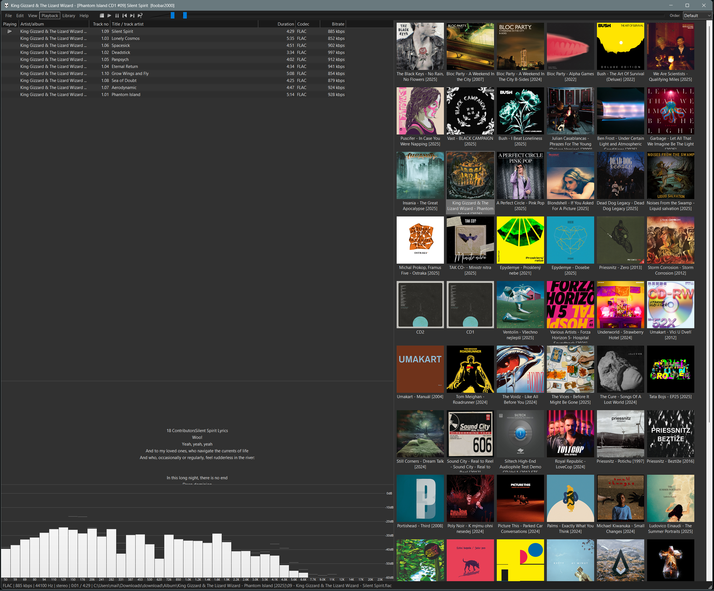

# Foobar Grid View - Album Art Grid Component

A modern, high-performance album art grid component for foobar2000 v2 (64-bit) that displays your music library in a customizable grid layout similar to Spotify, Apple Music, and other modern music players.




-green)


## 📋 Table of Contents
- [Features](#features)
- [Requirements](#requirements)
- [Installation](#installation)
- [Usage Guide](#usage-guide)
- [Configuration](#configuration)
- [Building from Source](#building-from-source)
- [Troubleshooting](#troubleshooting)
- [Contributing](#contributing)

## ✨ Features

### 🎨 Visual Display
- **High-quality album artwork** - Automatic thumbnail generation with bicubic interpolation
- **Smooth scrolling** - Optimized lazy loading for thousands of albums
- **Theme integration** - Automatically matches your foobar2000 color scheme
- **Customizable grid sizes** - From 60px to 250px per item
- **Progressive loading** - Images load smoothly in the background
- **Visual feedback** - Loading indicators, hover effects, and selection highlighting

### 🎯 Multi-Select Support
- **Ctrl+Click** - Toggle individual item selection
- **Shift+Click** - Select range of items
- **Ctrl+A** - Select all items
- **Drag selection** - Coming soon
- Play multiple selected albums at once

### 📝 Advanced Text Display
- **Full Unicode support** - Properly displays characters like č, š, ž, ™, ©, 中文, 日本語, etc.
- **Multi-line text** - Configure 1-3 lines of text per item
- **Word wrapping** - Long names wrap naturally
- **Track count display** - Optional "(n tracks)" indicator
- **Smart ellipsis** - Text truncates cleanly when needed

### 📁 Organization Options

#### Grouping Modes
- **By Folder** (default) - Groups by parent folder name
- **By Album** - Groups by album metadata
- **By Artist** - Groups by artist metadata

#### Sorting Options
- **By Name** - Alphabetical A-Z
- **By Date** - Newest files first
- **By Track Count** - Most tracks first

### ⚡ Performance Features
- **Lazy loading** - Only loads visible artwork
- **Smart caching** - Keeps recently viewed thumbnails in memory
- **Auto-refresh** - Detects library changes
- **Large library support** - Tested with 10,000+ albums
- **Memory efficient** - Automatic cache cleanup

## 📦 Requirements

- **foobar2000 v2.0 or later** (64-bit version only)
- **Windows 7 or later** (64-bit)
- **Visual C++ 2022 Redistributables** (usually already installed)
- At least 100MB free RAM for optimal performance

## 🚀 Installation

### Method 1: Direct Download (Recommended)
1. Download `foo_albumart_grid.dll` from the [Releases](https://github.com/veselyvaclavcz/foobar-grid-view/releases) page
2. Copy the file to one of these locations:
   - `%APPDATA%\foobar2000-v2\user-components-x64\` (recommended)
   - `[foobar2000 installation folder]\components\`
3. Restart foobar2000
4. The component will appear in the available UI elements

### Method 2: Install via foobar2000
1. Download `foo_albumart_grid.fb2k-component` from [Releases](https://github.com/veselyvaclavcz/foobar-grid-view/releases)
2. Double-click the file (it should open in foobar2000)
3. Click "Apply" in the components dialog
4. Restart foobar2000 when prompted

### Adding to Your Layout
1. Go to `View → Layout → Edit Layout`
2. Right-click where you want the grid to appear
3. Select either:
   - `Replace UI Element` (to replace existing element)
   - `Add New UI Element` (to add in a splitter)
4. Choose **"Album Art Grid"** from the list
5. Click OK and enjoy your grid view!

## 📖 Usage Guide

### Keyboard Shortcuts
| Shortcut | Action |
|----------|--------|
| **F5** | Refresh grid |
| **Ctrl+A** | Select all items |
| **Ctrl+Click** | Toggle item selection |
| **Shift+Click** | Range selection |
| **Ctrl+Mouse Wheel** | Resize grid |
| **Delete** | Remove selected from playlist (when applicable) |

### Mouse Controls
| Action | Result |
|--------|--------|
| **Single Click** | Select item |
| **Double Click** | Play item(s) |
| **Right Click** | Open context menu |
| **Mouse Wheel** | Scroll vertically |
| **Ctrl+Wheel** | Resize grid dynamically |
| **Hover** | Highlight item |

### Context Menu Options

#### Playback Options
- **Play** - Play selected items
- **Add to Current Playlist** - Append to active playlist
- **Add to New Playlist** - Create new playlist with selection

#### Display Options
- **Group**
  - By Folder (fastest, default)
  - By Album (with artist info)
  - By Artist (all albums by artist)
  
- **Sort**
  - By Name (alphabetical)
  - By Date (newest first)
  - By Track Count (most tracks first)
  
- **Size**
  - Small (80px)
  - Medium (100px)
  - Normal (120px)
  - Large (150px)
  - Extra Large (200px)
  
- **Text Lines**
  - Single Line (classic view)
  - Two Lines (balanced)
  - Three Lines (maximum info)

#### Other Options
- **Show Labels** - Toggle text on/off
- **Show Track Count** - Display number of tracks
- **Select All** - Select everything
- **Refresh** - Reload library

## ⚙️ Configuration

The component saves its configuration automatically. Settings include:
- Grid size
- Grouping mode
- Sort order
- Text display preferences
- Number of text lines

Configuration is stored in your foobar2000 profile and persists between sessions.

## 🔨 Building from Source

### Prerequisites
- Visual Studio 2022 (Community Edition or higher) or Build Tools
- Windows SDK 10.0.19041.0 or later
- foobar2000 SDK (included in repository)

### Build Steps
```batch
# Clone the repository
git clone https://github.com/veselyvaclavcz/foobar-grid-view.git
cd foobar-grid-view

# Run the build script
BUILD_V8.bat

# The compiled foo_albumart_grid.dll will be in the root directory
```

### Project Structure
```
foobar-grid-view/
├── SDK-2025-03-07/          # foobar2000 SDK
│   ├── foobar2000/          # Core SDK files
│   └── pfc/                 # PFC utility library
├── grid_v8.cpp              # Main source code (latest version)
├── BUILD_V8.bat             # Build script
├── README.md                # This file
├── LICENSE                  # MIT License
└── foo_albumart_grid.dll    # Compiled component
```

## 🐛 Troubleshooting

### Component doesn't appear in UI Element list
- Ensure you're using foobar2000 v2.x 64-bit
- Check that the DLL is in the correct components folder
- Try reinstalling Visual C++ 2022 Redistributables

### Crashes on startup
- Remove any older versions of the component
- Check for conflicting components
- Verify your foobar2000 installation is not corrupted

### Album art not loading
- Ensure your music files have embedded artwork
- Check that album art files are in the same folder as music
- Try refreshing with F5

### Performance issues
- Reduce grid size for better performance
- Disable text display if not needed
- Consider grouping by folder (fastest mode)

### Text encoding issues
- The component uses UTF-8 internally
- Ensure your tags are properly encoded
- Update to the latest version (v8.0+)

## 🤝 Contributing

Contributions are welcome! Please feel free to submit a Pull Request. For major changes, please open an issue first to discuss what you would like to change.

### Development Guidelines
- Follow the existing code style
- Test with large libraries (5000+ albums)
- Ensure backward compatibility
- Update documentation for new features

## 📜 Version History

- **v8.0.0** (Current)
  - Multi-select support with Ctrl/Shift+Click
  - Fixed Unicode text encoding
  - Multi-line text support (1-3 lines)
  - Improved context menu

- **v7.0.0**
  - Auto-load on startup
  - Progressive image loading
  - Sort options (name/date/count)

- **v6.0.0**
  - Major performance optimizations
  - Folder grouping mode
  - Lazy loading implementation

- **v5.0.0**
  - First version with actual album art
  - Theme color integration
  - Configuration persistence

- **v4.0.0**
  - UI element implementation
  - Context menu support

- **v1.0.0 - v3.0.0**
  - Initial development versions

## 📄 License

This project is licensed under the MIT License - see the [LICENSE](LICENSE) file for details.

## 🙏 Acknowledgments

- **Peter Pawlowski** and the foobar2000 team for the amazing player and SDK
- **Anthropic's Claude** for development assistance
- **The foobar2000 community** for inspiration and feedback
- Original inspiration from Spotify and Apple Music grid views

## 📮 Contact & Support

- **Issues**: [GitHub Issues](https://github.com/veselyvaclavcz/foobar-grid-view/issues)
- **Discussions**: [GitHub Discussions](https://github.com/veselyvaclavcz/foobar-grid-view/discussions)

---

**⚠️ Important Notes:**
- This component is for foobar2000 v2.x 64-bit ONLY
- Will NOT work with 32-bit versions or foobar2000 v1.x
- Requires Windows 7 or later (64-bit)

**Made with ❤️ for the foobar2000 community**